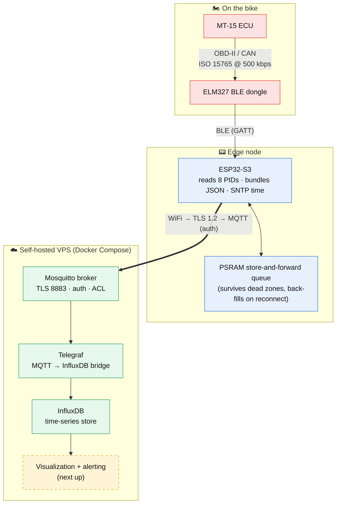

# 🏍️ Toothless Telemetry

**A real-time telemetry & observability pipeline that pulls live data off a motorcycle, ships it over an authenticated TLS broker, and lands it in a time-series database — built end-to-end, in public.**

---

Toothless Telemetry treats a **2024 Yamaha MT-15** as a live data source and builds a full observability pipeline around it: an ESP32-S3 edge node reads the bike's engine PIDs, bundles each cycle into one timestamped message, and ships it over an authenticated TLS broker into a time-series database for visualization and alerting.

It's the same architecture as production telemetry work — **edge collection → a message bus → a time-series backend**, with store-and-forward durability, TLS, secrets hygiene, and config-as-code throughout — with a motorcycle on the sensor end instead of a fleet of servers.

> If you're skimming: **the interesting engineering is in the pipeline, not the motorcycle.**

---

## 🧭 Architecture

Every client dials **outbound** to a single publicly-addressable broker, so the bike (on a phone hotspot) and the pipeline (on a VPS) reach each other across different networks with **no inbound routing or VPN** — MQTT's design does the NAT traversal for free.

---

## 🚦 Build status

Proven one layer at a time — *isolate one variable, prove each rung before the next.*

| Rung | Status |
|---|---|
| Edge node: BLE acquisition → WiFi → MQTT | ✅ Done |
| Real bike data over authenticated **TLS** to a public broker | ✅ Done |
| **Storage:** Mosquitto → Telegraf → InfluxDB (containerized, verified end-to-end) | ✅ Done |
| **Visualization + alerting** | ⬜ Next |
| Gear-from-ratio analyzer · durable offline buffer · permanent bike power | ⬜ Planned |

---

## ⚡ What works today

Live engine telemetry flows off the bike and across the internet, end-to-end, into a queryable database.

Each ~1-second cycle the edge node reads **eight live OBD-II PIDs** — RPM, speed, throttle, engine load, intake MAP, coolant temp, intake-air temp, module voltage — bundles them into a **single timestamped JSON message** (one point, many fields — the shape a time-series database actually wants), and publishes to the broker over TLS. A Telegraf bridge subscribes and writes each message into InfluxDB, preserving the reading's own timestamp so buffered data back-fills cleanly.

Verified full path, with the bike running:

> **bike → BLE → ESP32 → WiFi → TLS MQTT → Mosquitto → Telegraf → InfluxDB**

---

## 🗄️ The pipeline stack

The server side runs as **one Docker Compose stack** on a self-managed VPS — three services, one `docker compose up`:

| Service | Role |
|---|---|
| **Mosquitto** | The public rendezvous broker (TLS-only), where the bike and the pipeline meet |
| **Telegraf** | The zero-code bridge — subscribes to the telemetry topic, writes each message into InfluxDB |
| **InfluxDB** | The time-series store where readings land and are queried |

Only the broker's TLS port is exposed to the internet; the database and the internal bridge live on a private network, and the database UI is reached over an SSH tunnel — never a public port.

---

## 🧠 Skills this demonstrates

| Area | What's in the repo |
|---|---|
| **Edge / IoT collection** | C++/Arduino firmware on an ESP32-S3: concurrent BLE + WiFi radio coexistence, async SNTP time sync, MQTT publishing |
| **Time-series thinking** | One bundled message per cycle (one point, many fields); readings carry their own timestamp so back-filled data lands at record time, not ingest time |
| **Store-and-forward reliability** | Bounded PSRAM ring buffer behind an append/drain interface — acquisition decoupled from publishing, so a dead zone loses no data and the graph back-fills on reconnect |
| **Message bus** | Mosquitto MQTT on a public VPS so the bike can publish from any network (outbound-only, no home-LAN inbound routing) |
| **Containerized multi-service stack** | Broker + bridge + database as one declarative Docker Compose stack; data on named volumes that survive container churn |
| **Security posture** | TLS with the CA root pinned in firmware; broker auth + least-privilege ACL (a read-only account for the bridge); all secrets generated on-host and gitignored; committed docs kept free of host specifics |
| **Config-as-code & reproducibility** | `docker-compose.yml`, broker + bridge config, committed public CA, `platformio.ini`, `uv`/`pyproject` for the Python side |
| **Reverse engineering** | No published PID map exists for the MT-15; PIDs discovered by correlation and cross-referenced against the shared-ECU R15/MT-07 community data |

---

## 🛠️ Tech stack

- **Firmware:** C++/Arduino · ESP32-S3 · PlatformIO · NimBLE · PubSubClient
- **Transport:** MQTT over TLS 1.2 (Mosquitto, Let's Encrypt)
- **Pipeline:** Telegraf → InfluxDB (OSS v2), containerized with Docker Compose
- **Visualization:** Grafana (leading candidate — deliberate comparison still pending)
- **Tooling / analysis:** Python (Bleak for BLE, pipeline glue, analysis) · `uv`
- **Hardware:** ESP32-S3 (N16R8) · ELM327 BLE OBD-II dongle · MODAXE BS6 adapter

---

## 🛣️ Roadmap

- **Visualization & alerting** — dashboards over the live data; shift-point and throttle-aggression views. *(next)*
- **Gear-from-ratio analyzer** — derive gear and shift points from the RPM/speed relationship (no extra hardware).
- **Durable offline buffer** — a flash/SD tier behind the existing append/drain interface, for whole-ride and power-loss capture.
- **Automated off-box backups** of the time-series data.
- **Permanent bike power** — a switched/buck tap to retire the development power bank.

---

## 🧪 Engineering philosophy

**Isolate one variable at a time** — prove each layer before adding the next (`blink → serial → MQTT with fake data → real data → storage → viz`). **Always capture raw data.** **Design for the durable version now** (interfaces), build the simple version first (implementation). Where I over-engineer deliberately, I call it out as learning, not necessity.

Built in public · infrastructure is the profession, the motorcycle is the hook.

